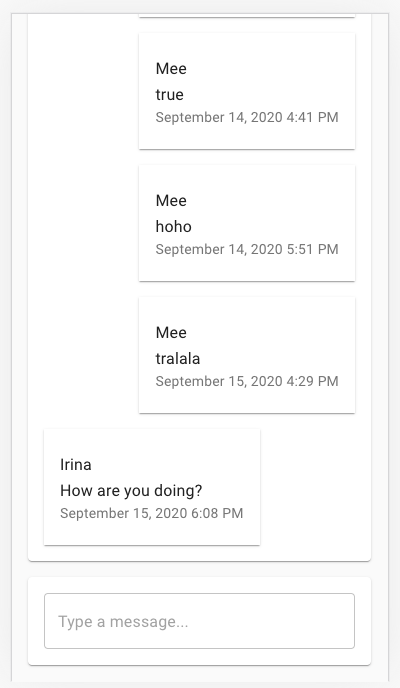

Chat Application
======

Description
----------------
Here is a chat web app for messages exchange



Features:
- User registration and authorization
- One common chat room for messages exchange between several users

Technologies:
+ MongoDB for storing messages and users
+ Backend part is written on Golang. Implemented REST Api and Websockets
+ Frontend part is written using create-react-app bootstrap

How to build and start
----------------
```
docker-compose up
```
This command will start Mongo, Backend and Frontend. The application will run on http://localhost:3000
